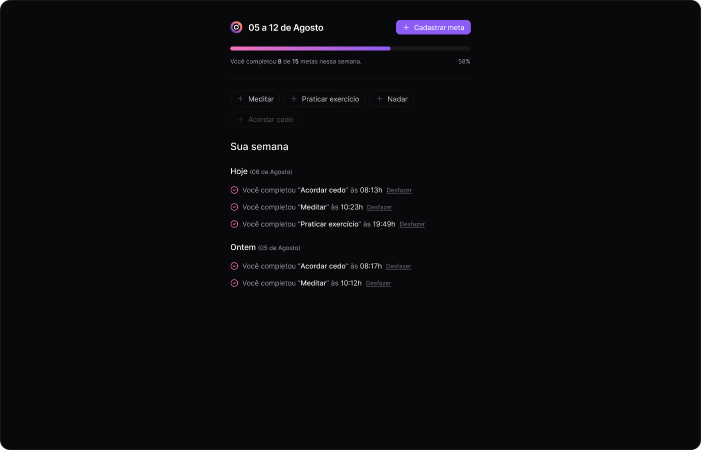

<h1 align="center">NLW 17 - Pocket</h1>

  <h3 align="left">Front-end</h3>
  

    
    
    
    
    
    
    
  

  
  <h3 align="left">Back-end</h3>
  

    
    
    
    
    
    
    
  

 

  

 

## 💻 Projeto

Projeto de um gerenciador de metas com funcionalidades como cadastro de meta, completar metas, visualização de metas concluídas na semana, etc. Desenvolvido durante o evento NLW 17 - Pocket, da Rocketseat.

## 🔖 Layout

Você pode visualizar o layout do projeto clicando [aqui](https://www.figma.com/community/file/1415093862269754302).
